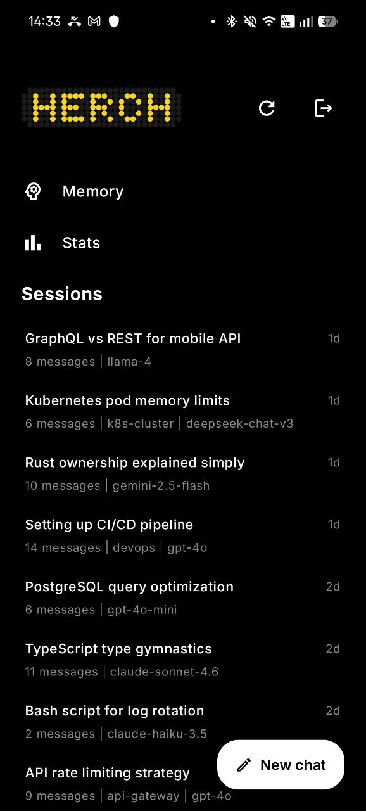
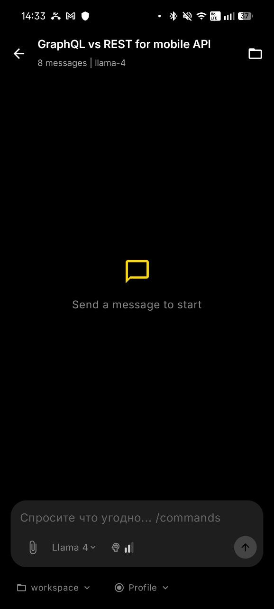

# Hermes native Android client.

An Android client for Hermes Web UI.
Based on the <a href="https://github.com/nesquena/hermes-webui">Hermes Web UI</a>
by nesquena, inspired by
<a href="https://hermexapp.com/">Hermex</a>, and built primarily for my own use. If you'd like to improve it, pull requests are always welcome.

## Features

* Chat sessions
* Messaging
* Workspace file management
* Simple and lightweight interface

## Screenshots
<p align="center">
  
  
</p>

## Getting Started

1. Download and install the APK.
2. Set up Hermes Web UI and configure a password by following the official tutorial:
   https://get-hermes.ai/setup/
3. Expose your Hermes Web UI instance to the internet (for example, by forwarding the port or using a service such as Cloudflare Tunnel).
4. Open the app and enter:

   * Server URL
   * Password

You're ready to go.

## Building from Source

You can build the project yourself using:

```bash
build.bat
```

## About the Project

This app was built almost entirely using free AI tools—it's 100% vibe-coded. I'm not a Kotlin developer, so the code may not be perfect, but it works and I'm continuously improving it.

## Requirements

* **Minimum Android version:** Android 7.0 (Nougat)
* **minSdk:** 24
